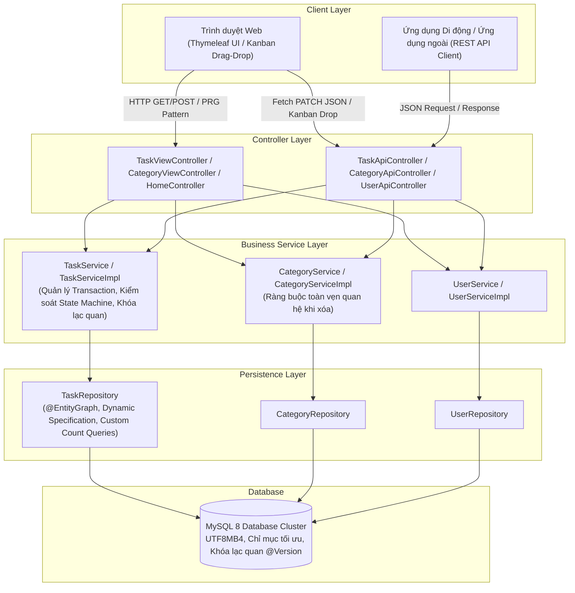
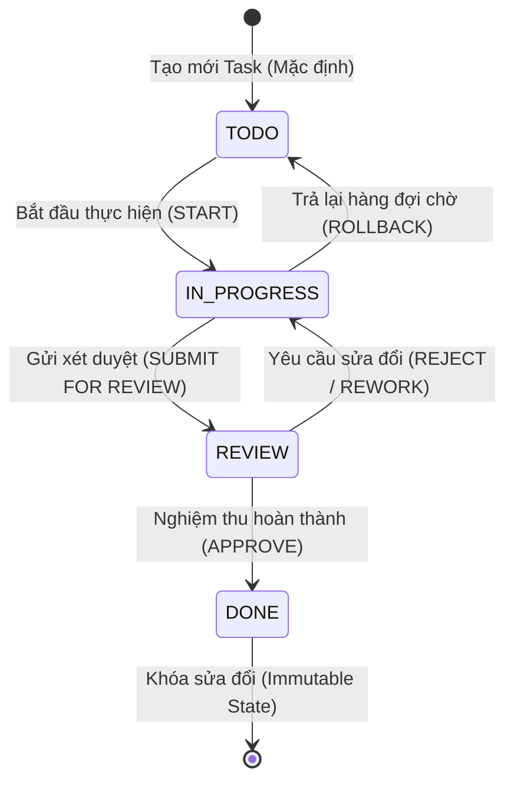
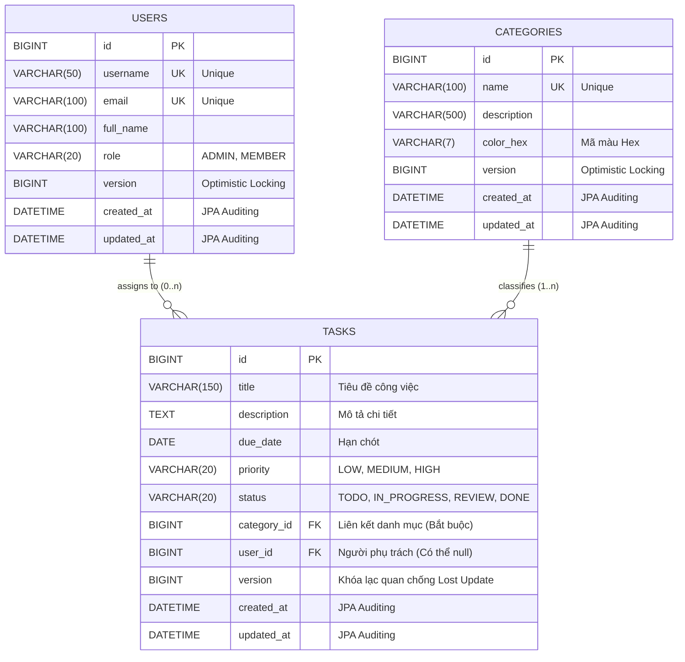

# Task & Workflow Management System
> **Hệ thống Quản lý Công việc & Luồng tác vụ chuẩn Doanh nghiệp / Ngân hàng (Enterprise & FinTech Grade)**

[](https://www.oracle.com/java/)
[](https://spring.io/projects/spring-boot)
[](https://www.mysql.com/)
[](https://www.thymeleaf.org/)
[](https://getbootstrap.com/)
[](LICENSE)

---

## 📌 1. Giới thiệu tổng quan (Project Overview)

**Task & Workflow Management System** là dự án Backend mô phỏng hệ thống quản lý công việc và quy trình tác vụ nghiệp vụ nội bộ theo tiêu chuẩn khắt khe của khối **Doanh nghiệp & Ngân hàng (Enterprise Core Banking / FinTech)**.

Dự án được xây dựng với mục tiêu thể hiện năng lực lập trình backend bài bản:
1. **Kiến trúc 3 lớp phân tách tuyệt đối:** `Controller` &rarr; `Service` &rarr; `Repository`.
2. **CRUD chuyên sâu & Tìm kiếm tối ưu:** Phân trang, lọc đa tiêu chí động qua `JPA Specification`, cơ chế sắp xếp an toàn bằng danh sách trắng (Whitelist Sorting) chống tấn công SQL Injection.
3. **Quản lý vòng đời trạng thái (State Transition Machine):** Kiểm soát nghiêm ngặt luồng công việc theo mô hình hữu hạn trạng thái (FSM) đóng gói trực tiếp trong `Enum`.
4. **Kiểm soát lỗi & Kiểm thực đầu vào tập trung:** Chuẩn hóa toàn bộ lỗi đầu ra theo định dạng `ApiResponse` thống nhất, mã lỗi phân loại theo `ErrorCode`, không để lộ stack trace ra phía client.
5. **Kiến trúc Hybrid hiện đại:** Giao diện Server-Side Rendering (Thymeleaf + Bootstrap 5 + Dark Mode) và hệ thống RESTful API JSON dùng chung **100% tầng nghiệp vụ Service và Repository**.
6. **Xử lý tranh chấp đồng thời (Concurrency Handling):** Áp dụng cơ chế **Khóa lạc quan (Optimistic Locking)** với `@Version` ngăn chặn lỗi mất dữ liệu khi nhiều người dùng thao tác cùng lúc (Lost Update Problem).

---

## 🏛️ 2. Sơ đồ Kiến trúc & Thiết kế hệ thống (System Architecture)

### 2.1. Kiến trúc phân tầng Hybrid (Architecture Diagram)



---

### 2.2. Máy trạng thái hữu hạn vòng đời công việc (Finite State Machine)

Trạng thái công việc không được phép nhảy cóc tùy tiện mà phải tuân theo sơ đồ luồng tác vụ doanh nghiệp:



#### Bảng quy tắc chuyển đổi trạng thái (State Transition Matrix):

| Trạng thái hiện tại | Bước kế tiếp hợp lệ | Ý nghĩa nghiệp vụ |
| :--- | :--- | :--- |
| **`TODO`** (Chờ thực hiện) | `IN_PROGRESS` | Developer / Chuyên viên tiếp nhận và bắt đầu làm việc. |
| **`IN_PROGRESS`** (Đang làm) | `REVIEW`, `TODO` | Chuyển sang chờ Tech Lead xét duyệt hoặc trả lại hàng đợi chờ do đổi ưu tiên. |
| **`REVIEW`** (Chờ duyệt) | `DONE`, `IN_PROGRESS` | Tech Lead nghiệm thu đạt hoặc từ chối duyệt để yêu cầu làm lại. |
| **`DONE`** (Đã hoàn thành) | *(Không có - Final state)* | Đã hoàn tất và nghiệm thu. **Khóa sửa đổi nội dung (HTTP 409 nếu cố tình sửa)**. |

---

## 🗄️ 3. Thiết kế Cơ sở dữ liệu & Thực thể (Database Schema & ERD)



### Các chỉ mục tối ưu hóa truy vấn (Database Indexes):
- `idx_tasks_status` trên cột `status`: Tối ưu hóa truy vấn bảng Kanban và bộ lọc trạng thái.
- `idx_tasks_due_date` trên cột `due_date`: Tối ưu hóa thống kê công việc quá hạn và sắp xếp theo hạn chót.
- `idx_tasks_category_id` trên cột `category_id`: Tối ưu hóa các thao tác lọc danh sách và bảo đảm kiểm tra toàn vẹn khi xóa danh mục.

---

## 💡 4. Những quyết định Kiến trúc then chốt (Architectural Rationales)

| Yếu tố thiết kế | Lựa chọn kỹ thuật | Lý do thiết kế trong môi trường Doanh nghiệp / Ngân hàng |
| :--- | :--- | :--- |
| **Java 17 LTS Records** | DTO Response dùng `record` | Đảm bảo tính **Bất biến (Immutable)** của dữ liệu phản hồi, cú pháp sạch, tự sinh equals/hashCode, tránh rò rỉ trạng thái ngầm. |
| **Vô hiệu hóa OSIV** | `spring.jpa.open-in-view = false` | Ngăn chặn hiện tượng âm thầm phát sinh câu lệnh truy vấn Lazy ngoài Controller gây nghẽn kết nối Database (Database Connection Starvation) và hiệu ứng N+1. |
| **Chống N+1 Query** | `@EntityGraph` & `FETCH JOIN` | Nạp kèm quan hệ `category` và `assignee` trong đúng 1 câu lệnh SQL duy nhất khi truy vấn danh sách, giảm tải kết nối DB lên đến 90%. |
| **Khóa lạc quan** | `@Version private Long version;` | Ngăn chặn hiện tượng ghi đè dữ liệu mất mát (Lost Update) khi 2 chuyên viên cùng mở một task và cập nhật cùng lúc. Trả về mã lỗi chuẩn `409 CONFLICT`. |
| **Bảo mật SQL Injection** | Dynamic JPA Specification + Whitelist Sort | Tuyệt đối không cộng chuỗi SQL. Toàn bộ tham số được bind qua `CriteriaBuilder`. Các trường sắp xếp được kiểm tra nghiêm ngặt qua tập hợp hợp lệ: `{"id", "title", "dueDate", "priority", "status", "createdAt"}`. |
| **Thủ tục ánh xạ DTO** | Manual Mapper (Tự viết tay) | Loại bỏ sự phụ thuộc vào Reflection hoặc thư viện bên thứ ba (ModelMapper/MapStruct); tốc độ thực thi tối đa, kiểm soát 100% logic nghiệp vụ tính cờ `isOverdue` và `statusBadgeClass`. |
| **Trải nghiệm kéo thả** | Kanban Drag & Drop + Optimistic UI | Kéo thả HTML5 mượt mà, kiểm tra luật State Machine ngay tại Client, gọi API cập nhật bất đồng bộ, tự động hoàn trả thẻ (Rollback) nếu Server từ chối giao dịch. |

---

## 🚀 5. Hướng dẫn Cài đặt & Khởi chạy (Quick Start Guide)

### 5.1. Yêu cầu môi trường (Prerequisites)
- **JDK:** Java 17 hoặc Java 21 LTS trở lên.
- **Database:** MySQL 8.0+ (khuyến nghị chạy qua Laragon, XAMPP hoặc Docker).
- **Công cụ xây dựng:** Maven (đã tích hợp sẵn tệp thực thi `mvnw.cmd` / `mvnw`).

### 5.2. Cấu hình cơ sở dữ liệu
1. Mở MySQL Client và tạo cơ sở dữ liệu:
   ```sql
   CREATE DATABASE task_manager CHARACTER SET utf8mb4 COLLATE utf8mb4_unicode_ci;
   ```
2. Kiểm tra thông tin kết nối trong tệp [`src/main/resources/application-dev.properties`](file:///d:/laragon/www/Task-Manager/src/main/resources/application-dev.properties):
   ```properties
   spring.datasource.url=jdbc:mysql://localhost:3306/task_manager?useUnicode=true&characterEncoding=UTF-8&serverTimezone=Asia/Ho_Chi_Minh
   spring.datasource.username=root
   spring.datasource.password=${DB_PASSWORD:vanh2005}
   ```
   *(Bạn có thể thay đổi biến môi trường `DB_PASSWORD` hoặc sửa trực tiếp mật khẩu phù hợp với máy cá nhân).*

### 5.3. Khởi chạy ứng dụng
Chạy ứng dụng bằng lệnh Maven Wrapper:
```bash
# Trên hệ điều hành Windows:
.\mvnw.cmd spring-boot:run

# Trên hệ điều hành Linux / MacOS:
./mvnw spring-boot:run
```

Ngay khi khởi động thành công, thành phần **[`DataSeeder.java`](file:///d:/laragon/www/Task-Manager/src/main/java/com/example/taskmanager/config/DataSeeder.java)** sẽ tự động nạp dữ liệu mẫu ban đầu và mã hóa mật khẩu bằng BCrypt:
- **Tài khoản đăng nhập nội bộ (Mật khẩu dùng chung cho tất cả tài khoản: `123456`):**

| Vai trò | Tên đăng nhập | Email | Mật khẩu | Quyền hạn & Không gian mặc định |
| :--- | :--- | :--- | :--- | :--- |
| **Quản trị viên** | `admin` | `admin@bank.corp` | `123456` | **ROLE_ADMIN** &rarr; Bảng điều khiển ([`/dashboard`](http://localhost:8080/dashboard)), Quản lý thành viên ([`/users`](http://localhost:8080/users)), Tạo/Sửa/Xóa Task. |
| **Trưởng nhóm** | `dev_lead` | `lead@bank.corp` | `123456` | **ROLE_MEMBER** &rarr; My Task ([`/tasks/my-tasks`](http://localhost:8080/tasks/my-tasks)), Bảng Kanban, Lịch làm việc cá nhân. |
| **Lập trình viên** | `developer` | `dev@bank.corp` | `123456` | **ROLE_MEMBER** &rarr; My Task ([`/tasks/my-tasks`](http://localhost:8080/tasks/my-tasks)), Cập nhật tiến độ task được giao. |

- **4 Danh mục phân hệ nghiệp vụ:** Core Banking Migration, Payment Gateway, Fraud Detection, DevOps Pipeline.
- **28 Công việc mẫu:** Phân bố đầy đủ các trạng thái `TODO`, `IN_PROGRESS`, `REVIEW`, `DONE` và các đầu việc quá hạn.

### 5.4. Truy cập giao diện Web
- **Trang Đăng nhập:** [http://localhost:8080/login](http://localhost:8080/login) *(Hệ thống tự động điều hướng về trang này nếu chưa xác thực)*
- **Bảng điều khiển (Dashboard - Admin):** [http://localhost:8080/dashboard](http://localhost:8080/dashboard)
- **Không gian cá nhân (My Task - Member):** [http://localhost:8080/tasks/my-tasks](http://localhost:8080/tasks/my-tasks)
- **Bảng Kanban kéo-thả:** [http://localhost:8080/tasks/kanban](http://localhost:8080/tasks/kanban)
- **Lịch công việc trực quan:** [http://localhost:8080/tasks/calendar](http://localhost:8080/tasks/calendar)
- **Quản lý thành viên (Admin):** [http://localhost:8080/users](http://localhost:8080/users)

---

## 📡 6. Đặc tả REST API & Mẫu câu lệnh kiểm thử (cURL Examples)

Toàn bộ phản hồi API được chuẩn hóa theo cấu trúc `ApiResponse<T>`:
```json
{
  "success": true,
  "message": "Thao tác thành công",
  "data": { ... },
  "errorCode": null,
  "timestamp": "2026-10-08T09:00:00"
}
```

### 6.1. Danh sách các API chính

| Phương thức | Đường dẫn API | Chức năng |
| :---: | :--- | :--- |
| `GET` | `/api/v1/tasks` | Lấy danh sách task (hỗ trợ phân trang, sắp xếp và lọc đa tiêu chí) |
| `GET` | `/api/v1/tasks/{id}` | Lấy chi tiết 1 task theo ID |
| `POST` | `/api/v1/tasks` | Tạo mới task (Bắt buộc dueDate &ge; hôm nay; status luôn là `TODO`) |
| `PUT` | `/api/v1/tasks/{id}` | Cập nhật thông tin task (chặn sửa nếu task đã `DONE`) |
| `PATCH` | `/api/v1/tasks/{id}/status` | Chuyển đổi trạng thái (kiểm tra luật State Machine và `@Version`) |
| `DELETE` | `/api/v1/tasks/{id}` | Xóa vĩnh viễn công việc |
| `GET` | `/api/v1/tasks/kanban` | Lấy dữ liệu 4 cột trên bảng Kanban gom nhóm sẵn |
| `GET` | `/api/v1/categories` | Lấy danh sách tất cả các danh mục |
| `POST` | `/api/v1/categories` | Tạo danh mục mới (bắt buộc tên duy nhất và mã màu `#RRGGBB`) |
| `DELETE` | `/api/v1/categories/{id}` | Xóa danh mục (chặn xóa nếu đang có task liên kết - HTTP 409) |
| `GET` | `/api/v1/users` | Lấy danh sách người dùng cho dropdown giao diện |

---

### 6.2. Mẫu câu lệnh kiểm thử nhanh bằng cURL

#### 1. Lấy danh sách Task có phân trang và lọc đa tiêu chí:
```bash
curl -X GET "http://localhost:8080/api/v1/tasks?page=0&size=5&status=IN_PROGRESS&priority=HIGH&sortBy=dueDate&sortDirection=ASC" \
  -H "Accept: application/json"
```

#### 2. Tạo mới một công việc:
```bash
curl -X POST "http://localhost:8080/api/v1/tasks" \
  -H "Content-Type: application/json" \
  -d '{
    "title": "Tích hợp xác thực sinh trắc học FaceID cho giao dịch ngân hàng",
    "description": "Tuân thủ quyết định 2345/QĐ-NHNN về giải pháp an toàn trong thanh toán trực tuyến.",
    "dueDate": "2026-12-31",
    "priority": "HIGH",
    "categoryId": 2,
    "assigneeId": 3
  }'
```

#### 3. Chuyển đổi trạng thái công việc (Áp dụng State Machine & Khóa lạc quan):
```bash
curl -X PATCH "http://localhost:8080/api/v1/tasks/1/status" \
  -H "Content-Type: application/json" \
  -d '{
    "status": "IN_PROGRESS",
    "version": 0
  }'
```

#### 4. Thử vi phạm luật State Machine (Ví dụ nhảy cóc từ `TODO` sang thẳng `DONE` &rarr; Nhận lỗi HTTP 422):
```bash
curl -X PATCH "http://localhost:8080/api/v1/tasks/2/status" \
  -H "Content-Type: application/json" \
  -d '{
    "status": "DONE"
  }'
```
*Phản hồi lỗi chuẩn HTTP 422 Unprocessable Entity:*
```json
{
  "success": false,
  "message": "Không thể chuyển trạng thái công việc từ 'TODO' sang 'DONE'",
  "data": null,
  "errorCode": "INVALID_STATUS_TRANSITION",
  "timestamp": "2026-10-08T09:30:00"
}
```

> **Gợi ý kiểm thử:** Dự án đã xuất sẵn tệp [**`postman_collection.json`**](file:///d:/laragon/www/Task-Manager/postman_collection.json) ở thư mục gốc. Bạn có thể mở Postman và Import trực tiếp để chạy toàn bộ các kịch bản kiểm thử API.

---

## 🧪 7. Kiểm thử tự động (Automated Test Suite)

Dự án sở hữu bộ kiểm thử tự động gồm **41 test cases** bao phủ toàn diện từ cấp độ Repository, Service, Exception Handler đến WebMvc Slice:
```bash
.\mvnw.cmd clean test
```

### Báo cáo thống kê kiểm thử:
- **`TaskStatusTest`**: Kiểm thử máy trạng thái FSM (5 bước chuyển hợp lệ và các bước chuyển bất hợp lệ).
- **`TaskValidationAndMapperTest`**: Kiểm thử Bean Validation (`@NotBlank`, `@FutureOrPresent`, Groups `OnCreate`/`OnUpdate`) và thủ tục ánh xạ Manual Mapper.
- **`ApiExceptionHandlerTest`**: Kiểm thử xử lý lỗi tập trung, mã HTTP tương ứng và loại trừ rò rỉ stack trace.
- **`TaskRepositoryTest`**: Kiểm thử JPA Auditing, câu truy vấn đếm thống kê và cơ chế nạp quan hệ chống N+1.
- **`TaskServiceImplTest` & `CategoryServiceImplTest`**: Kiểm thử logic nghiệp vụ, chặn xóa danh mục có task, chặn sửa task đã DONE.
- **`TaskApiControllerTest`**: Kiểm thử WebMvc slice kiểm tra định dạng phản hồi REST API JSON.
- **`TaskViewControllerTest`**: Kiểm thử mẫu PRG, Flash Attributes và khả năng render giao diện Thymeleaf không lỗi cú pháp.

---

## 🎯 8. Điểm nhấn nổi bật ghi vào CV (Resume Bullet Points)

Dưới đây là gợi ý các dòng mô tả súc tích, chuyên nghiệp mà bạn có thể đưa vào phần **Projects** trong CV ứng tuyển vị trí **Java Backend Intern / Junior**:

* **Dự án: Task & Workflow Management System (Spring Boot 3.4, Java 17, MySQL 8, Thymeleaf, Bootstrap 5)**
  - Thiết kế kiến trúc phân tầng chuẩn Enterprise (Controller &rarr; Service &rarr; Repository) phục vụ đồng thời mô hình Hybrid: Server-Side Rendering (Thymeleaf) và RESTful API.
  - Xây dựng cơ chế lọc đa tiêu chí linh hoạt và an toàn bằng **Spring Data JPA Specification + CriteriaBuilder** kết hợp danh sách trắng sắp xếp (Whitelist Sorting) chống tấn công SQL Injection.
  - Tối ưu hóa hiệu năng cơ sở dữ liệu: loại bỏ hoàn toàn hiện tượng N+1 Query thông qua `@EntityGraph`, cấu hình quan hệ một chiều `FetchType.LAZY` và vô hiệu hóa `Open Session In View (OSIV=false)`.
  - Quản lý vòng đời trạng thái công việc (TODO &rarr; IN_PROGRESS &rarr; REVIEW &rarr; DONE) theo mô hình **Finite State Machine (FSM)** đóng gói an toàn trong Enum.
  - Xử lý xung đột tranh chấp đồng thời (Concurrency Handling) bằng **Khóa lạc quan (Optimistic Locking `@Version`)**, bảo đảm tính toàn vẹn dữ liệu khi nhiều người dùng thao tác cùng lúc.
  - Xây dựng bảng Kanban tương tác kéo-thả (HTML5 Drag & Drop) đồng bộ API bất đồng bộ theo cơ chế Optimistic UI có khả năng tự động rollback khi phát sinh lỗi.
  - Viết bộ kiểm thử tự động **41 Unit & Slice Test Cases (JUnit 5, Mockito, MockMvc)** bảo đảm độ tin cậy và tuân thủ các nguyên tắc thiết kế phần mềm sạch (Clean Architecture).

---

## 📄 9. Bản quyền (License)
Dự án được phân phối dưới giấy phép [MIT License](LICENSE). Mã nguồn mở hoàn toàn cho mục đích học tập và phỏng vấn tuyển dụng.
